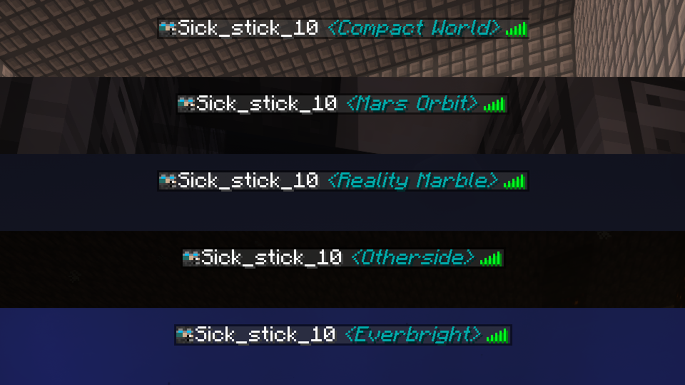
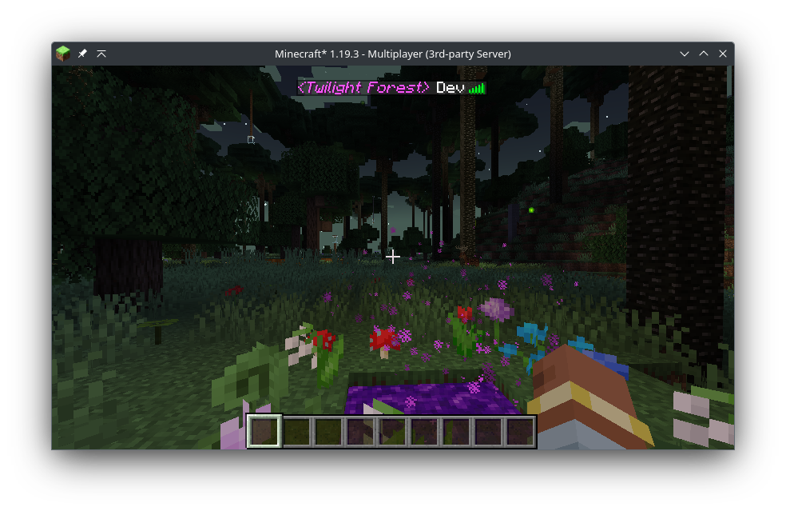
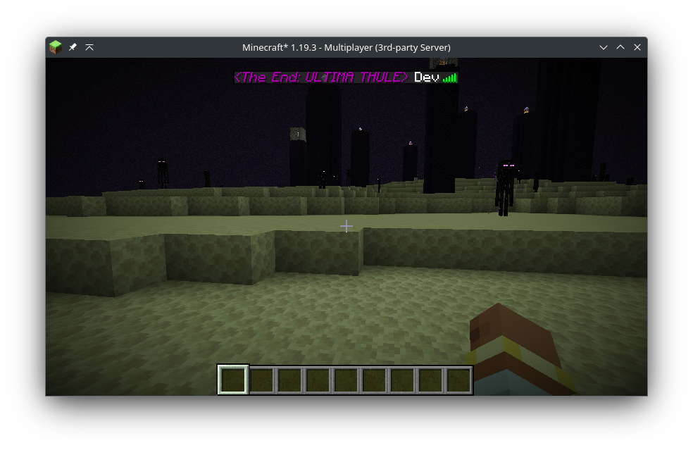

# Dimension Viewer
A highly customizable server-side Minecraft Forge mod for viewing what dimension players are currently in.

## Configuration
By modifying the config file, you can change the colour* of the text on a per-dimension basis, allow showing the dimension in chat messages and change the overall format of the dimension with the ability to use Minecraft text formatting such as underlining, bold and italic fonts.

The config file is located in `[world name]/serverconfig/dimensionviewer-server.toml`. Any changes made will be applied as soon as the config file is saved.

## Compatibility
Dimension Viewer should be compatible with all dimensions. There may be some cases where the mod name shown on hover is not formatted correctly due to the use of the modid to get which mod a dimension is from.

Mods that make changes to the tab list name format (or even the regular display name) will likely cause issues with this mod but at the moment I cannot think of any to test with. If you find any issues, [leave an issue](https://github.com/Ewan-Selkirk/Dimension-Viewer/issues/new).

If there are any issues encountered (no dimension being shown for a player) either have someone change dimension once or use the command `/refreshPlayerList` to try and manually update the player list.

## Features
### New in 1.3
Modded dimensions are now able to be coloured independently.

### New in 1.4
Dimension names can now be aliased to something else, allowing you to modify the name displayed per dimension.

## To-Do
- [ ] Implement custom font colors. (Possible but will take some re-architecting)

*Only default Minecraft text colours are currently available.  

<a href="https://www.curseforge.com/minecraft/mc-mods/dimension-viewer">.svg?badge_style=for_the_badge)</a>
.svg?badge_style=for_the_badge)

